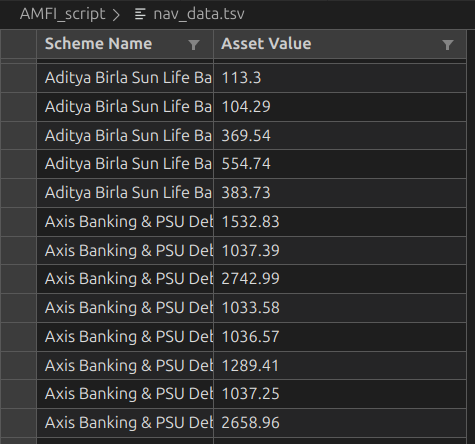

## AMFI NAV Data Extractor

Downloads the latest Mutual Fund NAV data from AMFI and stores it as a TSV file.

### Files
- `extract_amfi_data.sh`: Bash script to fetch and save the NAV dump
- `nav_data.tsv`: Output file containing the downloaded NAV data (tab-separated)

### Requirements
- bash (Linux/macOS)
- curl

### Usage
Run from this directory. Either:

Option A) Make the script executable and run it directly
```bash
chmod +x extract_amfi_data.sh
./extract_amfi_data.sh
```

Option B) Run via bash without changing permissions
```bash
bash extract_amfi_data.sh
```

Expected output (example):
```text
Cleaned TSV saved to nav_data.tsv
```


The script will:
- Download the latest NAV data from AMFI
- Save/overwrite `nav_data.tsv` in the same folder
