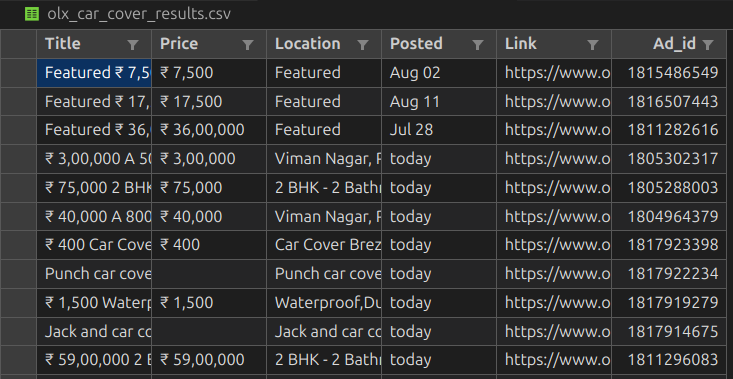

## OLX Car Cover Scraper

Scrapes OLX India search results for "car cover" listings and saves them to a CSV file.



### Features
- **Headless Selenium** browsing to render JavaScript pages
- Extracts: **title**, **price**, **location**, **posted**, **link**, **ad_id**
- De-duplicates by listing link
- Writes results to `olx_car_cover_results.csv`

### Requirements
- Python 3.9+
- Google Chrome installed
- A virtual environment is recommended

Python packages:
- `selenium`
- `bs4` (BeautifulSoup)
- `webdriver-manager` (optional but recommended)

### Quick Start
```bash
# From project root
python3 -m venv .venv
source .venv/bin/activate

pip install --upgrade pip
pip install selenium beautifulsoup4 webdriver-manager

# Run the scraper
python3 olx_car_cover_scraper.py
```

This will create/update `olx_car_cover_results.csv` in the project root.

### Script Overview
- Entry point: `olx_car_cover_scraper.py`
- Main function: `scrape_olx_car_covers_selenium(max_pages)`
  - Navigates paginated OLX results
  - Parses each page with BeautifulSoup
  - Collects rows and removes duplicates
- Output writer: `save_csv(rows, filepath)`

### Configuration
You can tweak these module-level constants in `olx_car_cover_scraper.py`:
- `BASE_URL` (default: `https://www.olx.in`)
- `SEARCH_PATH` (default: `/items/q-car-cover`)
- `MAX_PAGES` (default: `5`)
- `DELAY_BETWEEN_REQUESTS` seconds between pages (default: `2.0`)

### Output CSV Columns
- `title`
- `price`
- `location`
- `posted` (e.g., today, yesterday, N days ago, or MON DD)
- `link`
- `ad_id`

### Troubleshooting
- Selenium WebDriver init error:
  - If you see `TypeError: WebDriver.__init__() got multiple values for argument 'options'`, ensure the driver is initialized like:
    ```python
    from selenium import webdriver
    from selenium.webdriver.chrome.options import Options

    options = Options()
    options.add_argument("--headless=new")
    driver = webdriver.Chrome(options=options)
    ```
- Chrome/driver mismatch:
  - Install/update Chrome. `webdriver-manager` will download a compatible driver automatically.
- Empty results:
  - OLX may throttle or change markup. Increase delays, reduce pages, or update selectors in `parse_search_page` and `extract_card_data`.

### Notes and Ethics
- Respect OLX Terms of Service and `robots.txt`.
- Use reasonable delays to avoid overloading servers.
- Data is for educational/demo purposes.

### License
No license specified. All rights reserved unless otherwise noted.


